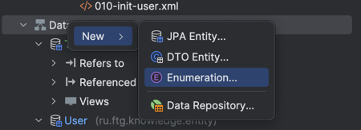
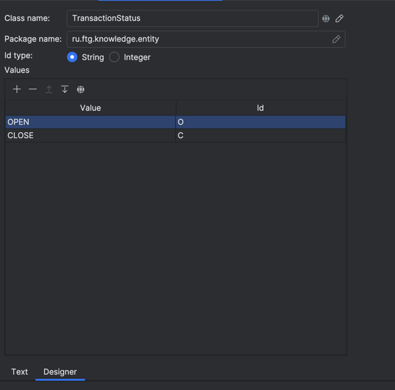
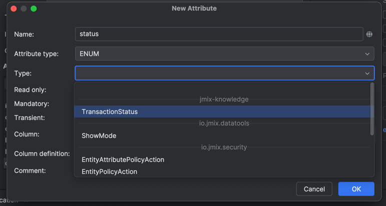

# Создание и добавление поля типа ENUM
## Создание
Для создание кликните правой кнопкой мыши по Data Models и выберите тип Enumeration и заполните поля имени типа id 


В дизайнере вы можете создать необходисы вам перечисления или написать тоже самое в коде


Вам будет сгенерироват такой класс
```java
public enum TransactionStatus implements EnumClass<String> {

    OPEN("O"),
    CLOSE("C");

    private final String id;

    TransactionStatus(String id) {
        this.id = id;
    }

    @Override
    public String getId() {
        return id;
    }

    @Nullable
    public static TransactionStatus fromId(String id) {
        for (TransactionStatus at : TransactionStatus.values()) {
            if (at.getId().equals(id)) {
                return at;
            }
        }
        return null;
    }
}
```

## Добавление

После создания класса он бцдет доступен в дизайнере для сущностей в Attribute type - ENUM


В коде будет сгенерировано такое поле
```java
    @Column(name = "STATUS", nullable = false)
    @NotNull
    private String status;

    public TransactionStatus getStatus() {
        return status == null ? null : TransactionStatus.fromId(status);
    }

    public void setStatus(TransactionStatus status) {
        this.status = status == null ? null : status.getId();
    }
```

Хранится в этом поле будет id enum